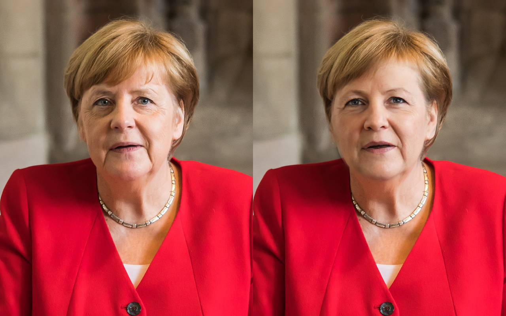
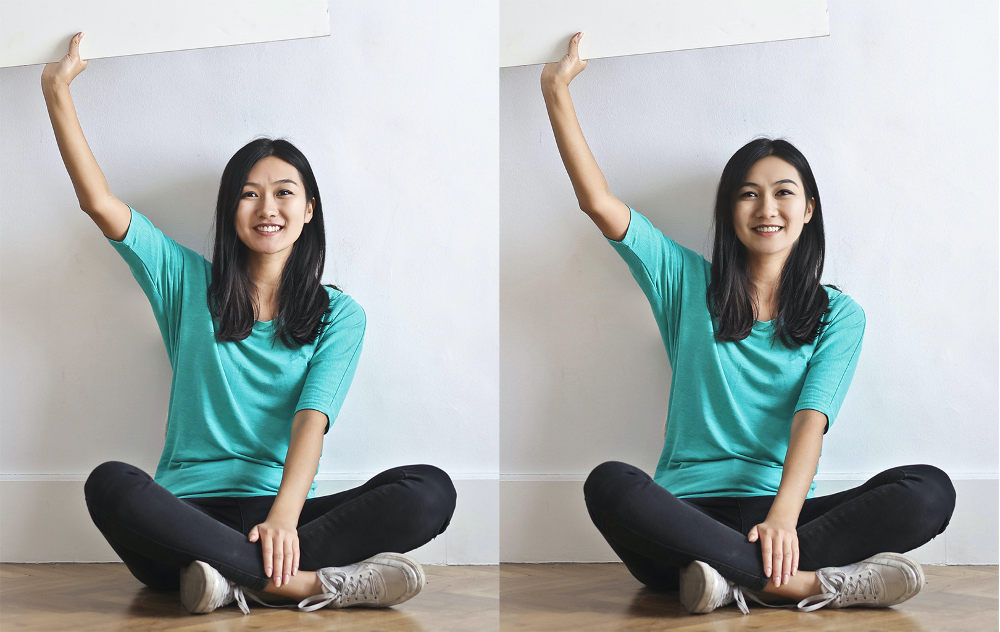
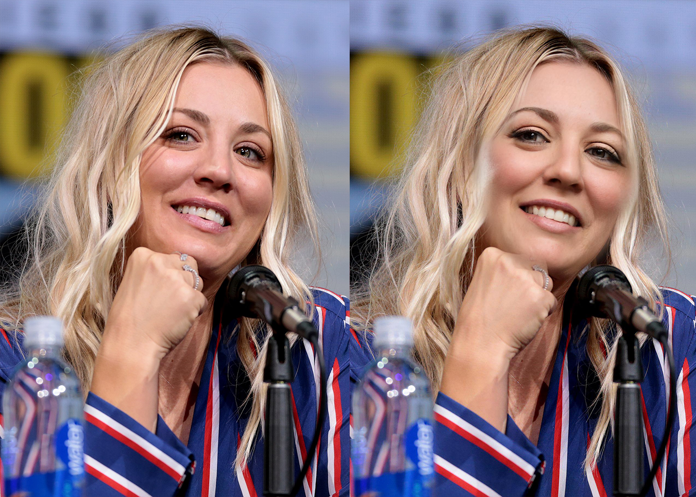
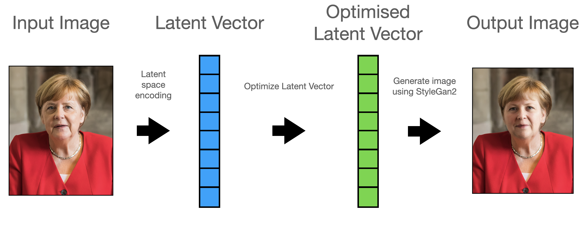

## RetouchML &mdash; Beautify faces on images using StyleGan2

Beautify images using StyleGan2.

Faces on images are recognized, normalised and converted into the corrensponding StyleGan2 Vector.

Afterwards, the vector will be optimized to "beautify" the face.

The face is then stiched back into the original image.

## Before/After examples:

All after images were generated entirely without human input.

`© Raimond Spekking / CC BY-SA 4.0​`

`© Gage Skidmore / CC BY-SA 3.0`

## Manual Editing

Latent space representations allow for manual changes to the output image.

## How does it work?

### 1. Latent space encoding

First, the image is encoded into latent space. A latent vector is found that closely represents out input image. The encoder used is based on [StyleGan2 Encoder](https://github.com/robertluxemburg/stylegan2encoder.git).

### 2. Latent vector optimisation

Now to the fun part. Using a neural network that judges attractiveness of latent vectors, that face is optimized by the neural network. 

Using a gradient ascent approach, the latent vector is slightly changed in the direction of steepest ascent, meaning we "make our face pretty".

We'll get a new latent vector that generates a "prettier" version of the original face.

### 3. Generate output image

The new latent vector is now converted back into an image by StyleGan2. The generated image is then stiched back into the original image.

## Want to try it for yourself?

Clone the Repo(it needs an Nvidia GPU with Cuda and Tensorflow) or use Google Colab. To get started follow Beautify.ipynb

