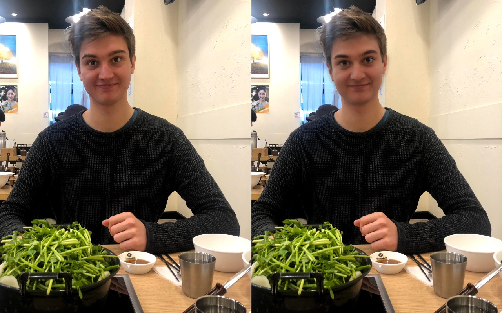

## RetouchML &mdash; Beautify faces on images using StyleGan2

Beautify images using StyleGan2.

Faces on images are recognized, normalised and converted into the corrensponding StyleGan2 Vector.

Afterwards, the vector will be optimized to "beautify" the face.

The face is then stiched back into the original image.

## Before/After examples:

© Raimond Spekking / CC BY-SA 4.0

## How does it work?

All the faces on the images are found and encoded into StyleGan2 using as slightly modified Version of [StyleGan2 Encoder](https://github.com/robertluxemburg/stylegan2encoder.git).

The vectors encoded into latent space are then optimized.

A second custom-trained Residual Network judging face attractiveness is used to find the direction of steepest ascend. By slightly changing the original latent vector into each dimension, then predicting the attrqactiveness again, the gradient can be build. This direction correspond to the direction in which the ResNet thinks the face will get "prettier". 

Scaling the latent vector into the direction will make the face become "prettier"(at least in the eyes of our ResNet 😅 ).

### Preferences of the ResNet

The ResNet used for "Beauty-Prediciton" seems to favour younger faces over older faces. In most test runs the optimization will try to make the face appear younger.

Skin is also smoothed in the process, this however could also be to limitiations of the encoder oder the StyleGan.

As can be seen in the second picture of myself, blue eyes seem to be perferable too. Maybe i should waer contac lenses from now 👀

## Want to try it for yourself?

Clone the Repo(it needs an Nvidia GPU with Cuda and Tensorflow) or use Google Colab. To get started follow Beautify.ipynb

